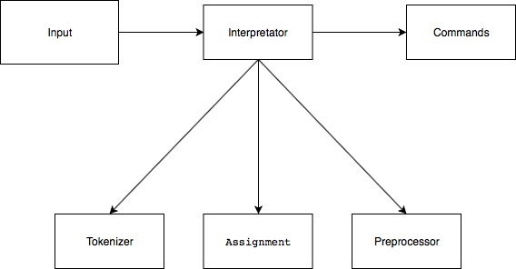

Tokenizer разбивает входной поток на токены

Assignment обновляет список локальных переменных

Preprocessor производит замены, удаляет ненужные символы

Интерпретатор находит подходящую команду ( все команды реализуют интерфейс BashCommand). 

Если такой нет, то вызывает внешнюю.